# Weariva - FullStack Ecommerce Application


---

## Description

Weariva is a full-stack e-commerce web application built with **Spring Boot** (backend) and **Thymeleaf** (frontend). It supports multiple roles - **Admin**, **User** and **Delivery**.

- **Admin** watches dashboard and manages products, orders, admins, users and deliveryboy status.
- **Users** can browse products, add to the cart, place orders, track them and make secure payments manually.
- **Delivery Boys** confirm successful deliveries and mark payments as completed in the system.

This application is designed for small businesses to track orders and handle manual payments efficiently.

## 📋 Table of Contents

1. [Features](#-features)
2. [Tech Stack](#-tech-stack)
3. [Roles & Access](#-roles--access)
4. [Demo Credentials](#-demo-credentials)
5. [Auto Data Setup](#-auto-data-setup)
6. [Setup Instructions](#-setup-instructions)
7. [Screenshots / Demo](#-screenshots--demo)
8. [Project Structure](#-project-structure)
9. [License](#-license)

## Features

- **Roles-Based Access Control** (Admin, User, DeliveryBoy)
- **Order Management** (Place, View, Update)
- **Manual Payment Verification** (Delivery/Counter Verification)
- **Admin Dashboard** for managing products and orders.
- **Spring Boot MVC + Thymeleaf** for server-side rendering
- **MySQL Database** for persistent data
- **Session-based success/error messages**
- **REST + MVC combination** for scalability
- **Order status tracking** (Pending, Out for Delivery, Delivered)

## Tech Stack

- **Backend** Spring Boot, Spring MVC, Spring Data JPA, Spring REST API
- **Frontend** Thymeleaf, HTML5, CSS3, TailwindCSS, FetchAPI
- **Database** MySQL
- **Build Tool** Maven
- **Language** Java 17+
- **Security** Spring Security (role-based access)

## Roles & Access

- **Admin** : Manage users, products, and all orders
- **User** : Browse products, place orders, view history
- **Delivery Boy** : Update delivery status and confirm payment

## Demo Credentials

- **Admin** -> username : **admin** & password : **admin123**
- **User** -> username : **johndoe** & password : **user123**
- **Delivery Boy** -> username : **deliveryboy** & password : **delivery123**

> These demo accounts are auto-created when the app runs for the first time.

## Auto Data Setup

When the application starts, it automatically creates:

- Default **users** for each role
- Some sample **products** for demonstration and its **ratings**

This is done using a `CommandLineRunner` class called **DataSeeder**:

```java
@Configuration
public class DataSeeder {
    @Bean
    CommandLineRunner initDatabase(UserRepository userRepo, ProductRepository productRepo) {
        return args -> {
            if (userRepo.count() == 0) {
                // Default users
            }
            if (productRepo.count() == 0) {
                // Default products
            }
        };
    }
}
```

## Setup Instructions

### 1. Clone the Repository

```bash
    git clone https://github.com/abhijeetyenaskar/Weariva-project.git
    cd Weariva-Project
```

### 2. Configure Environment Variables

- You'll find an **.env.example** in the project root folder. Copy it and remname it to **.env** :

```bash
    cp .env.example .env
```

- Then fill the credential required.

### 3. If you need to use TailwindCSS then install Node Modules (Optional) .

- In root folder, **npm install** and run **npm run build** command in the terminal.

### 4. Run the Application

- mvn clean install
- mvn spring-boot:run

### 5. Open application in the browser and visit :

- http://localhost:8080/

## Screenshots / Demo

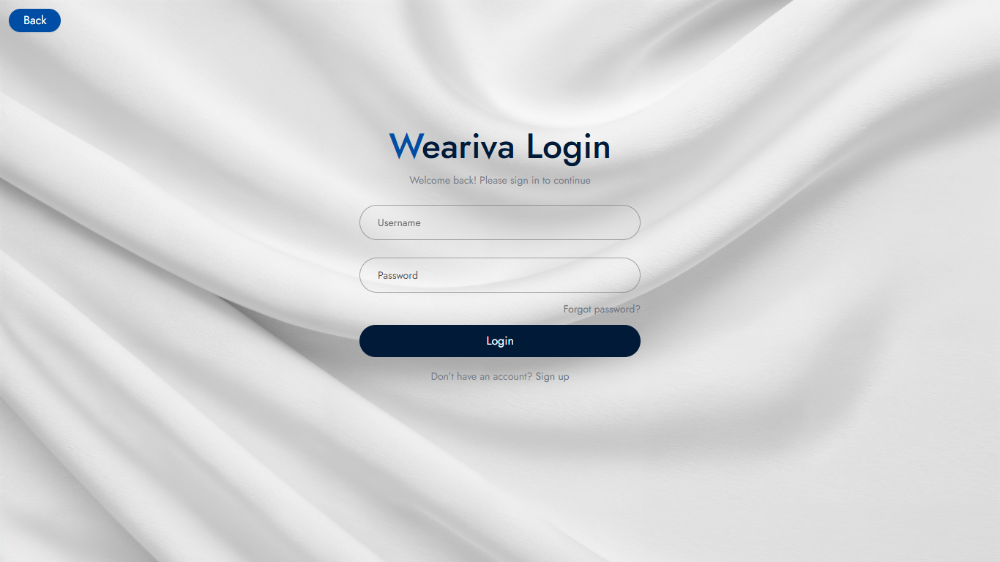
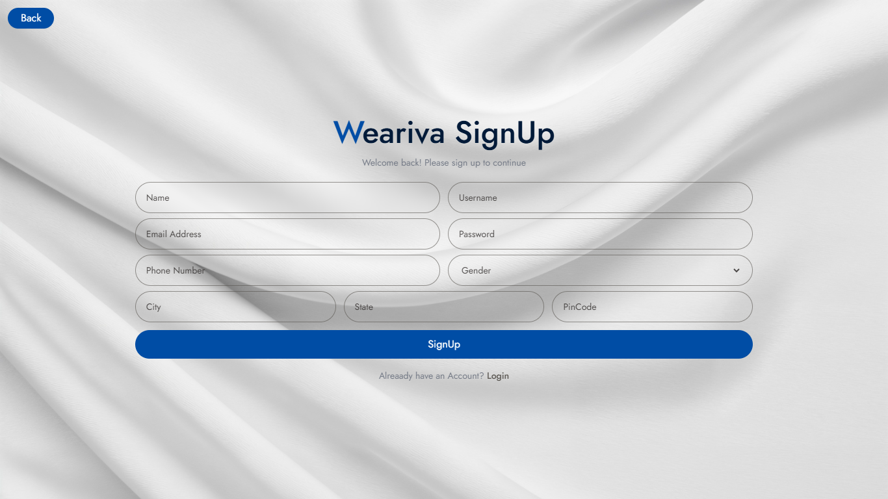
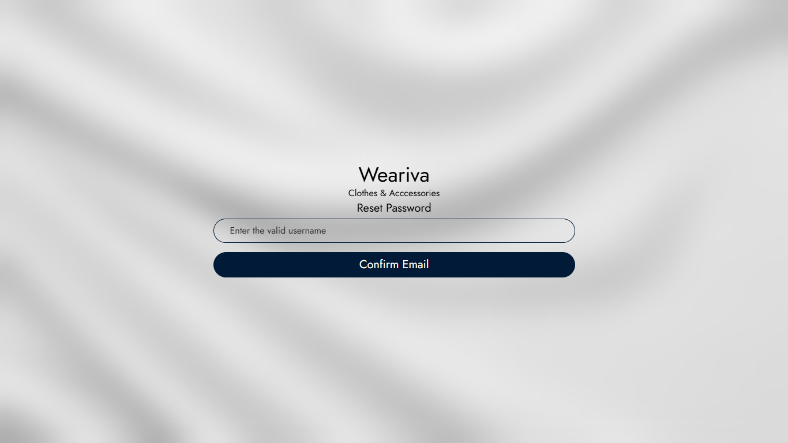
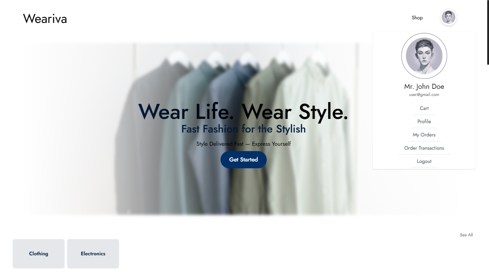
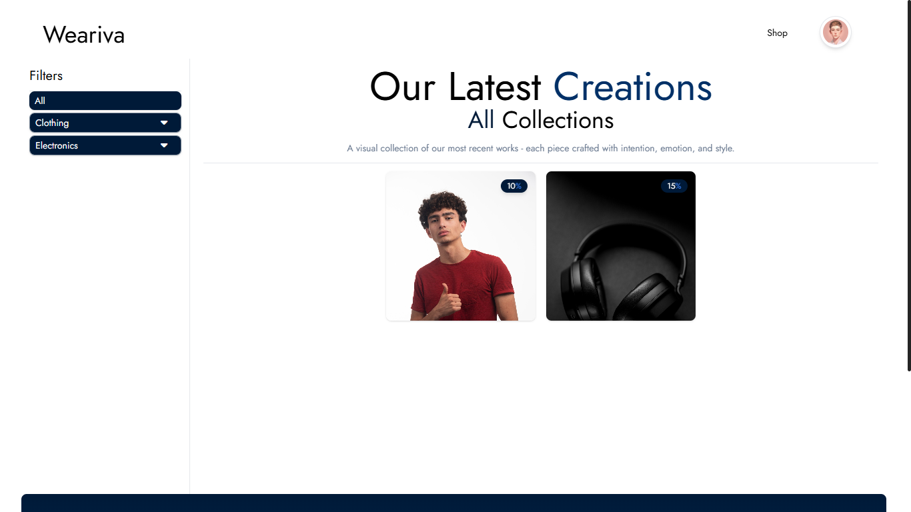
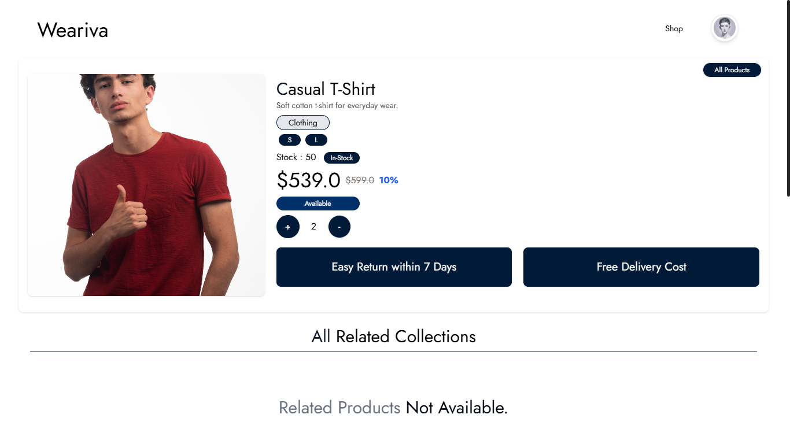
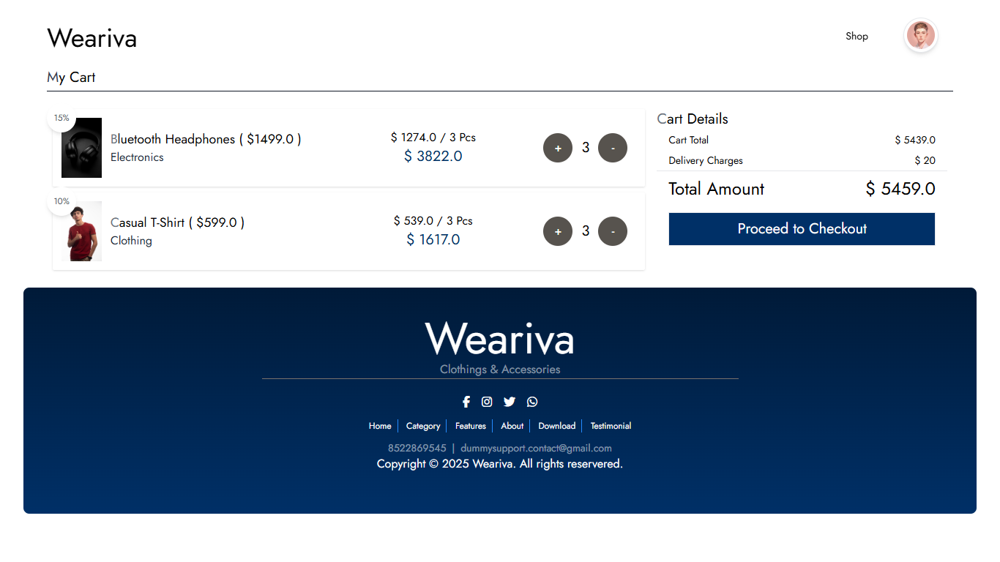
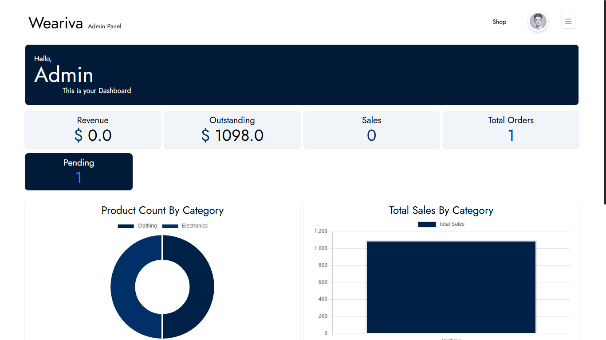
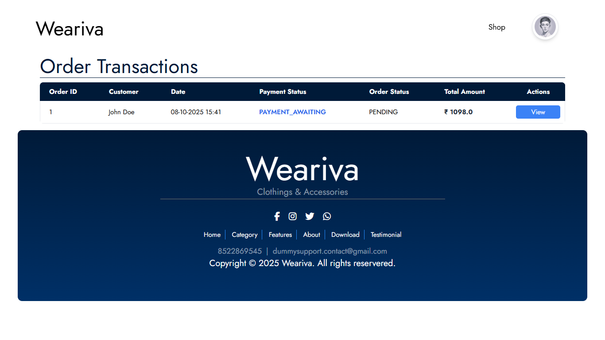
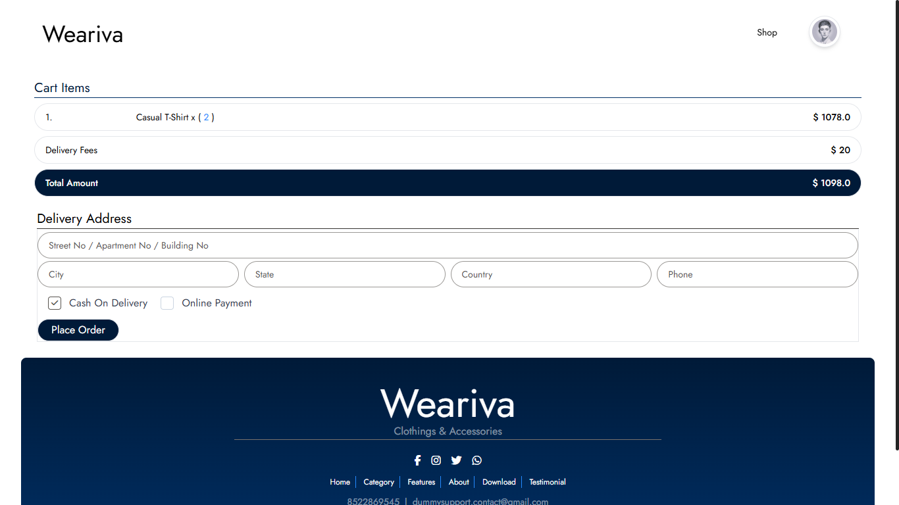
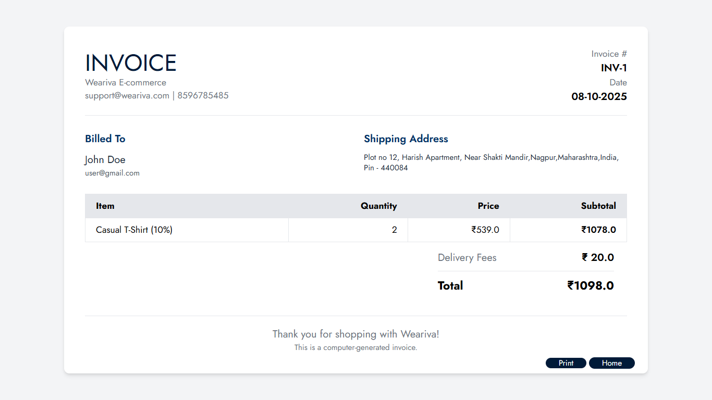

## Project Structure

    weariva-ecommerce-application/
    ├── screenshots/  # virtual representation
    ├── src/
    │ ├── main/
    │ │ ├── java/ecommerce/weariva/weariva_ecommerce/
    │ │ │ ├── configuration/
    │ │ │ ├── controller/
    │ │ │ ├── dtos/
    │ │ │ ├── enums/
    │ │ │ ├── models/
    │ │ │ ├── records/
    │ │ │ ├── repositories/
    │ │ │ └── services/
    │ │ ├── resources/
    │ │ │ ├── static/ # CSS, JS, Images
    │ │ │ ├── templates/ # Thymeleaf templates
    │ │ │ ├── application.properties
    │ │ │ └── banner.txt
    ├── .env.example
    ├── mvnw
    ├── mvnw.cmd
    ├── pom.xml
    ├── package.json
    ├── tailwind.config.js
    └── README.md

## Payment Flow

- This project uses a static/manual payment system for demonstration purposes:
- The User places an order (Cash on Delivery).
- The Delivery Boy / Counter Boy delivers the order.
- Once payment is collected, the Delivery Boy updates the system to mark payment as "Received".
- The Admin can view payment and delivery statuses in the dashboard.

## How It Works

- User signs up, signs in and places an order.
- Admin assigns delivery to a Delivery Boy.
- Delivery Boy updates order status after payment confirmation.
- System records transaction and updates order history.

## License

-This project is licensed under the MIT License — you are free to use, modify, and distribute it.

- MIT License
- Copyright (c) 2025 Conqueror
- Permission is hereby granted, free of charge, to any person obtaining a copy
  of this software and associated documentation files (the "Software"), to deal
  in the Software without restriction, including without limitation the rights
  to use, copy, modify, merge, publish, distribute, sublicense, and/or sell
  copies of the Software, and to permit persons to whom the Software is
  furnished to do so, subject to the following conditions:
- The above copyright notice and this permission notice shall be included in
  all copies or substantial portions of the Software.
- THE SOFTWARE IS PROVIDED "AS IS", WITHOUT WARRANTY OF ANY KIND, EXPRESS OR
  IMPLIED, INCLUDING BUT NOT LIMITED TO THE WARRANTIES OF MERCHANTABILITY,
  FITNESS FOR A PARTICULAR PURPOSE AND NONINFRINGEMENT. IN NO EVENT SHALL THE
  AUTHORS OR COPYRIGHT HOLDERS BE LIABLE FOR ANY CLAIM, DAMAGES OR OTHER
  LIABILITY, WHETHER IN AN ACTION OF CONTRACT, TORT OR OTHERWISE, ARISING FROM,
  OUT OF OR IN CONNECTION WITH THE SOFTWARE OR THE USE OR OTHER DEALINGS IN
  THE SOFTWARE.

## Author

- Developed by : Abhijeet Yenaskar
- 📧 abhijityenaskar26@gmail.com
- 🌐 https://github.com/abhijeetyenaskar
- If you like this project, please Drop ⭐ it on Github!!
